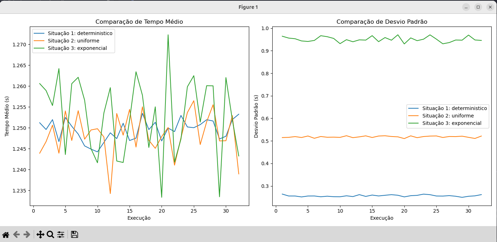

# Relatório de Simulação de Rede de Filas

Autor: Daniel de Sousa da Silva
DRE: 118064962

## Objetivo

Simular uma rede aberta de filas composta por três servidores (S1, S2 e S3) em três situações distintas, analisando o **tempo médio no sistema** e o **desvio padrão do tempo no sistema** após descartar os primeiros 10.000 jobs (fase de _warm-up_) e observar os próximos 10.000 jobs.

## Configurações das Situações Simuladas

1. **Situação 1**: Tempos de serviço determinísticos:

   - S1: 0.4s
   - S2: 0.6s
   - S3: 0.95s

2. **Situação 2**: Tempos de serviço uniformemente distribuídos:

   - S1: Intervalo (0.1s, 0.7s)
   - S2: Intervalo (0.1s, 1.1s)
   - S3: Intervalo (0.1s, 1.8s)

3. **Situação 3**: Tempos de serviço exponencialmente distribuídos:
   - S1: Média 0.4s
   - S2: Média 0.6s
   - S3: Média 0.95s

### Parâmetros Comuns

- Taxa de chegada: \(\lambda = 2\) jobs por segundo.
- Cada situação foi simulada 32 vezes para garantir resultados consistentes.

## Resultados Observados

### Situação 1

- **Tempo médio no sistema**: 4274.3938s
- **Desvio padrão**: 144.8786s

### Situação 2

- **Tempo médio no sistema**: 4205.1300s
- **Desvio padrão**: 121.8630s

### Situação 3

- **Tempo médio no sistema**: 4284.8948s
- **Desvio padrão**: 130.9677s

## Análise dos Resultados

1. **Tempos Médios**:

   - O tempo médio no sistema é ligeiramente maior nas situações 1 e 3 em comparação à situação 2. Isso sugere que a variabilidade nos tempos de serviço da situação 2 pode ajudar a suavizar o acúmulo de jobs, reduzindo o tempo médio no sistema.

2. **Desvio Padrão**:
   - A situação 2 apresenta o menor desvio padrão (121.8630s), indicando que os tempos no sistema foram mais uniformes.
   - Já na situação 1, com tempos determinísticos, o desvio padrão foi maior (144.8786s), possivelmente devido à interação fixa dos tempos de serviço com as filas.
   - A situação 3, com tempos exponenciais, também apresentou um desvio padrão relativamente baixo (130.9677s), mas ainda superior à situação 2.

## Conclusão

Os resultados mostram que a variabilidade nos tempos de serviço afeta significativamente o desempenho do sistema. A distribuição uniforme nos tempos de serviço (situação 2) foi a mais eficiente em termos de tempo médio no sistema e uniformidade dos resultados. As situações com tempos determinísticos e exponenciais apresentaram tempos médios similares, mas o desvio padrão na situação determinística foi ligeiramente mais elevado.

Estes resultados são coerentes com a expectativa de que a aleatoriedade introduzida pelos tempos de serviço pode afetar positivamente a dinâmica do sistema, dependendo da configuração das filas e dos servidores.
